# HTML Games

A collection of browser-based games and tools built with HTML5 Canvas and vanilla JavaScript. No dependencies, no installs — just open and play.
http://web-mage.ca/games/

---

## Games & Tools

### Cosmic Brick Breaker

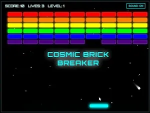

A cosmic-themed browser-based Brick Breaker game featuring procedural level generation and a robust power-up system. Includes advanced mechanics like indestructible blocks, dual laser cannons, safety nets, and varying difficulty hazards, all rendered with smooth canvas animations and retro-futuristic sound effects.

**Tags:** `Old School` `Arcade` `Space` `Action-Puzzle` `Power-ups` `Single-player`

---

### Cribbage Master

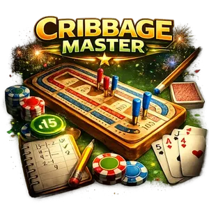

A feature-rich Cribbage game featuring an authentic S-track board, animated leapfrog pegging, and a statistical advisor. Play against a professional AI in a tournament-style environment with automatic scoring, synthesized sound effects, and celebratory fireworks.

**Tags:** `Cards` `Board Game` `AI` `Cribbage`

---

### Critter Lab

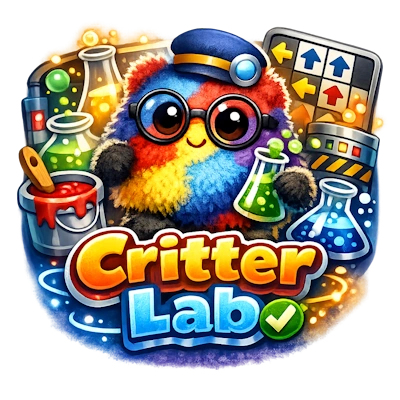

Colour Critter Factory is a logic-based puzzle game where players transform "fuzzy" critters using various lab tools. Match a target design by layering paints, patterns, and accessories while navigating complex masking logic and grid-based dipping directions. Includes a local save system.

**Tags:** `Logic` `Puzzle` `Educational` `Sequential Reasoning` `Kids`

---

### Cross Sums

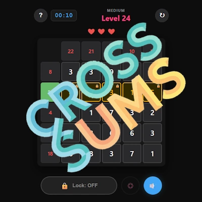

An addictive math puzzle game where you must remove numbers from a grid to make each row and column match a specific target sum. Features procedural level generation across multiple difficulties, a life system to punish incorrect deletions, and helpful tools like auto-locking solved rows.

**Tags:** `Logic` `Math` `Puzzle` `Strategy` `Educational`

---

### Cyber Serpent

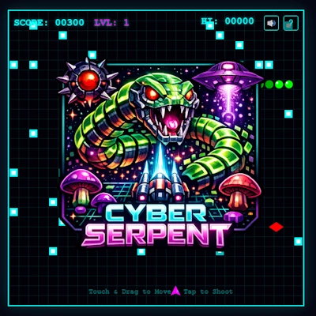

A neon-styled browser-based arcade shooter inspired by Centipede, featuring progressive difficulty and procedural level layouts. Includes classic mechanics like splitting serpents, regenerating obstacles, unique enemy behaviors like the Virus Drone and Corruptor, and user-friendly features like sound toggles and in-game help.

**Tags:** `Old School` `Cyberpunk` `Arcade` `Shooter` `Retro` `Survival`

---

### Cyber Squeeze

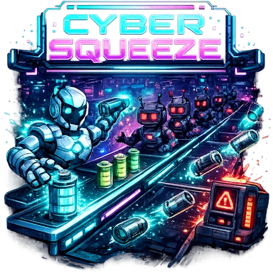

A high-speed arcade action game inspired by the classic Tapper. Serve energy batteries to thirsty androids across multiple lanes, catch empty casings to maintain station integrity, and survive increasingly fast levels in a neon-lit cyberpunk environment.

**Tags:** `Arcade` `Retro` `Action` `Cyberpunk` `Skill-based`

---

### Deep Digger

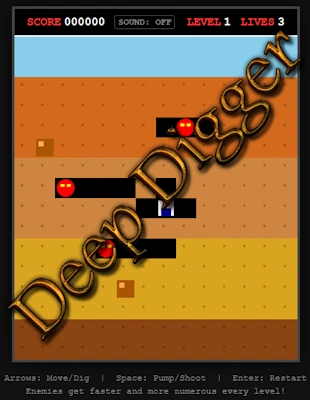

An arcade-style subterranean action game featuring tile-based digging mechanics and a retro pixel-art aesthetic. Manages player movement, enemy AI that tracks the player through tunnels, harpoon physics for inflating foes, and environmental hazards like falling rocks.

**Tags:** `Arcade` `Retro` `Action` `Strategy` `Old School`

---

### Dungeon Generator

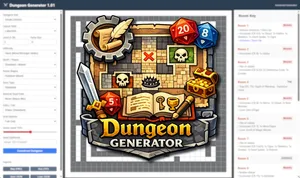

A robust browser-based Dungeon Generator for tabletop RPGs. Features procedural map creation with multiple layout algorithms (Standard, Mine, Labyrinth), customizable themes, difficulty scaling, and interactive canvas rendering. Generates room descriptions with monsters, traps, and treasure based on D&D 5e mechanics, with export options for maps and keys.

**Tags:** `TTRPG` `Procedural` `Tool` `D&D` `Map Generator`

---

### Entomologist's Expedition

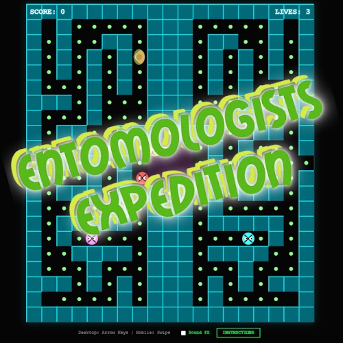

A browser-based arcade game utilizing procedural maze generation to create unique levels for every playthrough. Features a sophisticated Recursive Backtracker algorithm with mirroring logic to build balanced labyrinths, complex entity interactions, a Web Audio API sound manager, swipe-based mobile controls, and AI-driven Bug behaviors.

**Tags:** `Maze` `Arcade` `Action` `Retro` `Old School`

---

### Gem Pillars

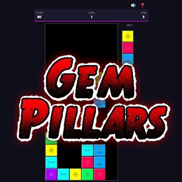

A vibrant, neon-infused puzzle game where you must strategically arrange falling vertical columns of three sparkling gems. Align three or more identical gems horizontally, vertically, or diagonally to clear them from the board, triggering explosive chain reactions that become increasingly challenging as the game speeds up.

**Tags:** `Puzzle` `Matching` `Strategy` `Arcade` `Old School`

---

### GrooveGen

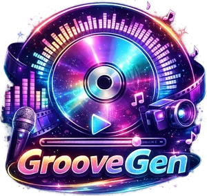

An audio visualizer and video generator that creates dynamic visuals for uploaded MP3 files. Features 28 visualization modes, custom cover art, lyric integration, video export (MP4/WebM), variable playback speed, timestamp tools, and advanced color customization (Solid / Gradient / Rainbow).

**Tags:** `Audio` `Visualizer` `Video` `Canvas` `Multimedia`

---

### Hangman

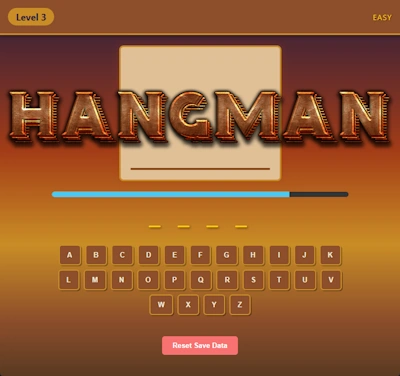

A high-stakes word puzzle where you must guess hidden phrases across 60 levels of increasing difficulty to prevent the gallows from being completed. Choose between Timer Mode for a high-pressure, rapid-fire experience or Relaxed Mode to solve linguistic mysteries at your own pace.

**Tags:** `Word` `Puzzle` `Educational` `Strategy` `Classic`

---

### ICON Maker

A client-side tool that converts common image formats into multi-size ICO files and Apple Touch icons directly in the browser. Features customizable fit modes, background color options, and real-time previews with legibility warnings for small icon resolutions.

**Tags:** `Tool` `Images` `ICO` `Web Tool`

---

### Lexi-Launch Defender

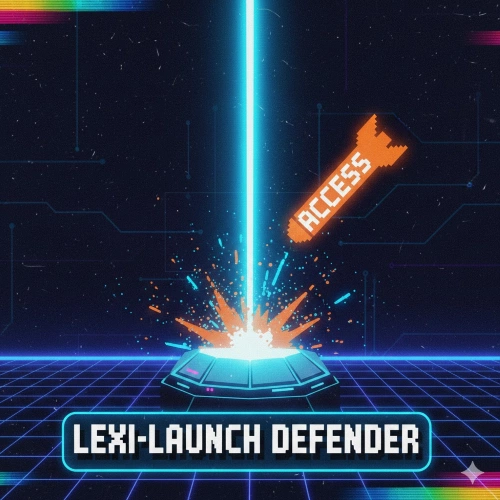

A high-octane "Y2K" aesthetic typing defense game where players protect ground-based shields by intercepting falling word-missiles. Features dynamic theme loading from external JSON, a ground-to-air laser interception system, scaling difficulty phases, and a custom Web Audio API synthesizer for retro sound effects.

**Tags:** `Typing` `Retro-Modern` `Canvas` `Educational` `WebAudio`

---

### Neon Gravity

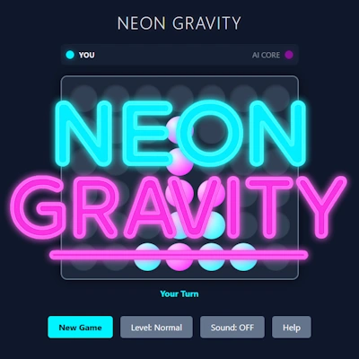

A sleek, futuristic strategy game where you must connect four cyan pieces in a row while battling a calculated Magenta AI. Set against a high-contrast neon grid, featuring gravity-driven mechanics, multiple difficulty levels ranging from Beginner to Hard, and immersive synthesized sound effects.

**Tags:** `Strategy` `Board` `Puzzle` `Multiplayer` `Old School`

---

### Neon MiniGolf

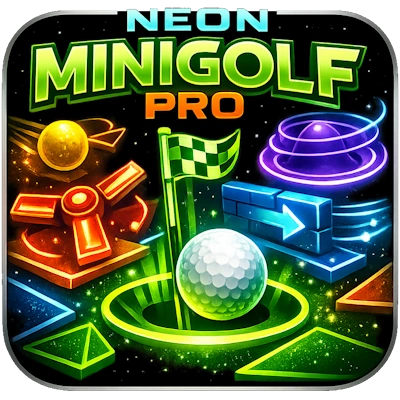

A neon-themed procedural 18-hole minigolf game featuring complex geometry including triangle tiles, dynamic obstacles like spinners and moving walls, and a choice-based powerup system for players who finish under par.

**Tags:** `Minigolf` `Procedural` `Canvas` `Physics` `Games`

---

### Neon Stack

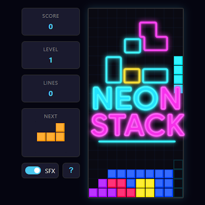

A sleek, futuristic block-stacking puzzle where you must strategically arrange falling neon shapes to clear horizontal lines and rack up high scores. Features a "ghost piece" for precision placement and a responsive interface designed for both desktop play and mobile touch controls.

**Tags:** `Puzzle` `Arcade` `Retro` `Strategy` `Old School`

---

### Pro Billiards

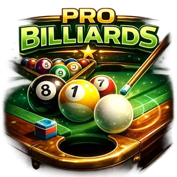

A high-fidelity physics-based pool simulator featuring authentic 8-Ball and 9-Ball modes. Play against an adjustable intelligent AI or practice solo in a responsive, mobile-optimized environment that automatically adapts to portrait and landscape orientations.

**Tags:** `Sports` `Simulation` `Physics` `8-Ball` `9-Ball` `AI`

---

### Silk and Silver

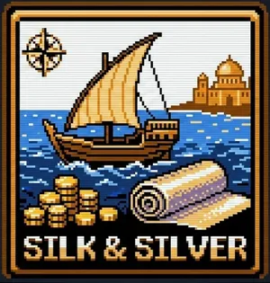

A deep maritime strategy game set in the Mediterranean. Navigate historical ports to buy low and sell high on commodities ranging from grain to illicit hashish. Manage compounding debt, bank profits in Venice, and upgrade your ship's hull and arsenal. Balance cargo space with cannons to survive turn-based naval battles against the Borgia Syndicate in this high-stakes quest for fortune.

**Tags:** `Strategy` `Simulation` `Trading` `Adventure` `Old School`

---

### Spin-a-Word

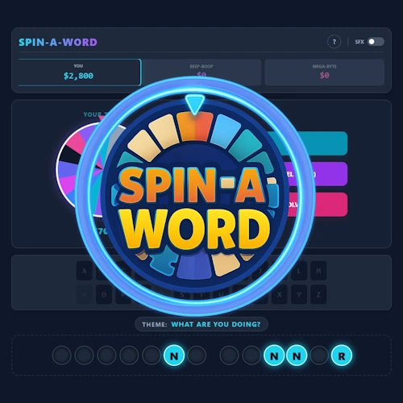

A cosmic-themed word puzzle where you spin a high-contrast neon wheel to earn cash and reveal hidden phrases. Strategically buy vowels and outsmart clever AI bots to solve the mystery and claim your accumulated fortune.

**Tags:** `Word` `Puzzle` `Simulation` `Educational` `Game Show` `Old School`

---

### Steel Beam Climber

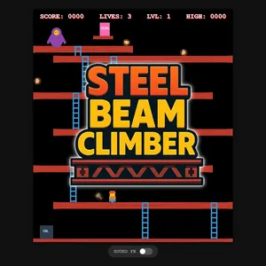

An action-packed arcade platformer where you guide Jack the Carpenter through a dangerous construction gauntlet to confront a Giant Ape. Navigate a zigzagging maze of girders and ladders while leaping over rolling barrels or smashing them with a golden hammer to reach the top.

**Tags:** `Platformer` `Arcade` `Retro` `Action` `Old School`

---

### Styler QR Pro

A sophisticated web-based tool for creating highly customizable, brand-aligned QR codes with support for linear/radial gradients and unique corner shapes. Features a robust logo integration system with adjustable clearance to ensure maximum scannability and professional aesthetics.

**Tags:** `QR Code` `Images` `Web Tool` `Tool`

---

### Swamp Hopper

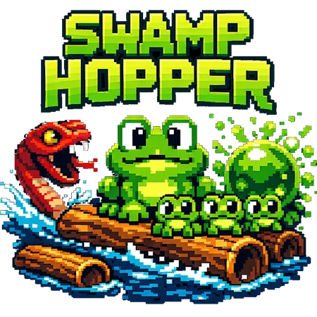

An arcade-style survival game where you navigate a treacherous swamp to rescue baby hoppers. Avoid predatory Mud Snakes that dive to hide, dodge exploding toxic bubbles, and master the timing of moving logs across increasingly difficult levels.

**Tags:** `Arcade` `Retro` `Action` `Skill-based` `Pixel-Art`

---

### Tank Wars

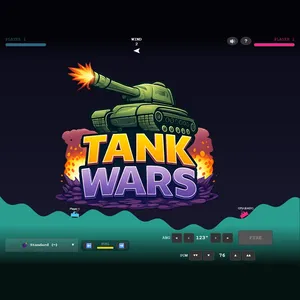

A strategic combat game where you control powerful tanks to destroy opponents across fully destructible, physics-based terrain. Command an arsenal of over 30 unique weapons — from standard shells to orbital strikes — while accounting for shifting wind speeds and limited fuel.

**Tags:** `Strategy` `Artillery` `Simulation` `Tactical` `Old School`

---